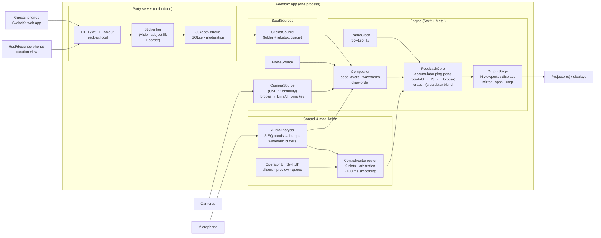
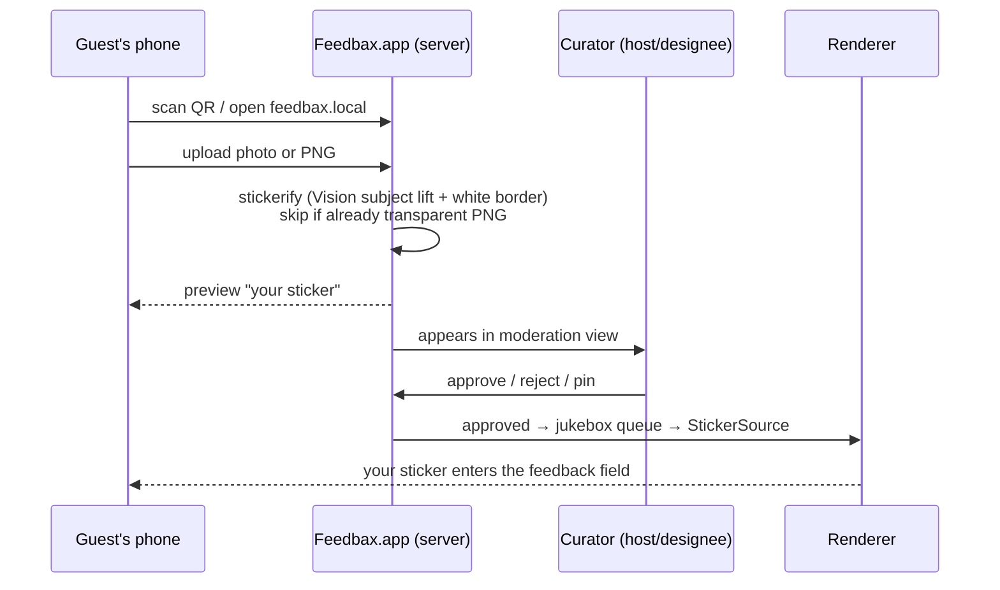

# Feedbax reimplementation — substrate proposal and design

**Status:** proposal for review · **Date:** 2026-08-23
**Source of truth for behavior:** [`docs/spec/`](../../spec/README.md) (the extracted description of what
Sean's patch does). This document decides *where* and *how* to rebuild it, not *what* it does —
where the two disagree, `docs/spec/` wins.

---

## 1. Goals

Ranked. The first two are the drivers named for this proposal; the rest come from the project's
history and the party scenario.

1. **Accessibility.** A non-technical person double-clicks an app and Feedbax runs. No Max
   license, no patch files, no engine preferences, no "why is the window black" (the failure mode
   that motivated the diagnosis doc).
2. **Extensibility.** Adding a new way to get imagery/video into the instrument — or a new way to
   control it — means implementing one small interface, not rewiring a patch.
3. **The party scenario.** A mac mini + projector + microphone is a complete rig. Guests hit
   `feedbax.local` on their phones, upload images that get stickerified, and a curated jukebox
   queue feeds them into the visuals. People near the rig affect the rendering in ways they can
   understand. Cameras and depth/hand sensors are additive, not required.
4. **Fidelity.** Sean was proud of 8K. Mac-mini-class Apple silicon is the minimum bar; the port
   should exploit unified memory and Metal, and reproduce the documented look *exactly* — the
   fold math, the non-standard blend, the HSL drift (§6 checklist).
5. **Multi-display.** Something Sean never got out of Max. The architecture should treat outputs
   as N viewports over one canvas from day one, even if the first pass ships with one.

### Non-goals (first pass)

* Cross-platform. We buy the Mac APIs deliberately (see §3 trade-offs).
* A third-party plugin SDK. Extensibility means clean *internal* protocols; scripting/embedding
  can come later without redesign.
* NDI, PTZ camera control, Mira/iPad parity. The control-surface *shape* survives (§5); the
  specific hardware bindings don't.
* Preset/scene recall beyond load-time defaults — the original never had it (spec §04). A minimal
  "save current settings" is cheap and worth doing, but performance-grade preset morphing is not
  first-pass.

---

## 2. What we're porting, in one breath

A 60 Hz feedback loop: partially erase the accumulator, warp the previous frame
(rotate/zoom/pan with mirror-fold edges, additive HSL shift), draw fresh seed material *under* it
(stickers, movie frames, keyed camera, two audio waveforms), blend the warped past over the
present with `(SRC_ALPHA, DST_ALPHA)`, capture, repeat. Seven live control slots plus erase
amount and a kaleidoscope sign-flip, everything ramped over ~100 ms. That's the whole instrument;
the character lives in about five exact constants and two shaders (spec README, "What makes the
look").

This is *small*. The Max patch is large because Max makes plumbing visible and Sean kept eight
years of scaffolding. The extraction pass confirms the portable core is ~3 fragment shaders, one
compositor, one audio analysis chain, and a control-vector router.

---

## 3. Substrate decision

### Options considered

**A. Native Swift + Metal app, with the guest-facing web app in SvelteKit (recommended).**
SwiftUI shell; Metal render core; AVFoundation for cameras (USB, and any iPhone via Continuity
Camera — zero drivers); AVAudioEngine + vDSP for mic analysis; Vision's subject-lifting
(`VNGenerateForegroundInstanceMaskRequest`, macOS 14+) for stickerification; an embedded HTTP/
WebSocket server (Hummingbird or FlyingFox) serving a static SvelteKit build; Bonjour for
`feedbax.local`; GRDB/SQLite for the queue; Developer ID + notarization for "download and
double-click".

* *For:* Every hard requirement lands on a first-class API. Camera frames reach the GPU zero-copy
  (`CVMetalTextureCache` — the unified-memory win, material at 4K camera input). Multi-display is
  native (`NSScreen` + one `CAMetalLayer` per output). Stickerification is a free, excellent
  on-device model. Permissions (mic/camera) behave like an app, because it is one.
* *Against:* Mac-only, and Swift isn't Ethan's daily language. Mitigation: everything guest- and
  curator-facing is SvelteKit (the daily stack); the Swift core is small and changes rarely once
  parity is reached — the extension points (§5) are deliberately the boring part.

**B. Rust + wgpu.** Portable, Metal underneath, excellent GPU abstraction.
* *Against:* the non-GPU half fights the platform — camera capture on macOS via third-party
  AVFoundation bindings, no Vision (stickerify needs a bundled ONNX model), windowing/fullscreen/
  multi-display rougher, signing/packaging DIY. We'd spend the portability dividend before ever
  leaving the Mac, and the "use the Mac APIs" driver says we don't want to leave.

**C. Web-first (Tauri/Electron + WebGPU).** Entirely in the daily stack.
* *Against:* 8K60 ping-pong is at the edge of what a webview will sustain on a mini; fullscreen
  across multiple displays from a browser context is genuinely bad; camera/format control and
  future depth sensors are constrained by browser APIs. The web layer is the right tool for the
  *phone-facing* surface — which every option includes — but the wrong place for the render loop.

**Rejected without deep analysis:** TouchDesigner (recreates the Max problem: license, runtime,
not an app), openFrameworks/Cinder (C++ maintenance for fewer platform wins than Swift),
Unity/Godot (an engine's worth of ceremony for three shaders, plus export/licensing friction).

### Recommendation

**Option A: native where the GPU and the devices are, web where the people are.** One process,
one .app: the Metal engine and the embedded server live together, so the queue, the renderer, and
the operator UI share state without IPC.

---

## 4. Architecture



### The frame loop (unchanged from spec, restated for the port)

Per tick, in this exact order (spec README; ordering is load-bearing):

1. Partially erase the accumulator toward black: `α = 0.8 + 0.2·t³`, `t` = erase control ∈ [0,1].
   A blend toward the erase color, never a clear; **α is the one unsmoothed parameter**.
2. Warp the previous frame's texture: rota (inverse warp, pixel coordinates, anchor 0.5/0.5,
   mirror-fold bounds) → additive HSL → (optionally brcosa, the v122 look — see §6).
3. Draw seed layers and waveforms *first*.
4. Draw the warped previous frame *over* them as a full-screen quad with blend
   `(SRC_ALPHA, DST_ALPHA)` — not alpha-over.
5. Present; the accumulator becomes next frame's "previous" by ping-pong swap.

Where Max needed a fragile screen-capture step (the very thing that broke the repo on Max 9), a
Metal port renders to texture natively — step 5 is a pointer swap, not a copy. Same math, zero
legacy risk.

**Resolution/rate:** presets 720p → 8K (7680×4320) and 30–120 Hz, plus custom. Live re-size of
the accumulator, as the original did. RGBA8 accumulator by default (parity — the original was
8-bit); RGBA16F as a quality toggle where bandwidth allows.

**8K feasibility, honestly:** an 8K RGBA8 surface is ~127 MB. With the warp+HSL fused into one
pass and composite-in-place (no copy, ping-pong swap), a frame touches roughly 3 full surfaces
≈ 380 MB → ~23 GB/s at 60 Hz — comfortable even on a base M-series mini (M4 ≥ 120 GB/s).
RGBA16F at 8K60 (~46 GB/s) also fits. Sean hit 8K in Max over OpenGL 2; Metal on Apple silicon
clears that bar with headroom for the camera and multi-display work Max couldn't do.

**Multi-display:** the engine renders one canvas; each attached display gets a window +
`CAMetalLayer` viewport with modes *mirror*, *span* (canvas partitioned across displays), or
*crop* (each display frames a region). Per-display vsync via `CAMetalDisplayLink`. First pass
ships mirror + span; the viewport abstraction is what matters now.

---

## 5. The extension interfaces (driver #2)

Three small protocols, extracted from how the original actually routes data. Everything the party
scenario adds later — depth sensors, more cameras, generative layers — is an implementation of
one of these, not a change to the engine.

### `SeedSource` — "a thing that produces imagery"

```swift
protocol SeedSource: AnyObject {
  var id: SourceID { get }
  /// Called on the frame clock. Return the current texture, or nil to skip this frame.
  func tick(_ frame: FrameContext) -> MTLTexture?
  var transform: LayerTransform { get set }   // position, scale, rotationZ (imageMove shape)
  var layer: LayerSettings { get set }        // z-order, blend mode, enabled
  var capabilities: SourceCapabilities { get } // .keying, .deviceSelection, .list, .ptz…
}
```

Rules the extraction surfaced, honored at the protocol level:

* Sources decode on *selection*, never per render frame; movies advance on their own clock
  (AVPlayer), and `tick` merely fetches the current frame.
* Keying (two-pass luma cascade, HSV-weighted chroma, one shared backdrop color) is a decorator
  applied to camera-class sources only — sticker alpha passes straight through, as the original.
* List-backed sources (sticker folder, jukebox queue) publish their item count so index-based and
  normalized-[0,1] selectors rebind live on rescan.
* The camera/picture decision is one explicit mode switch producing one texture per frame — the
  original's three-toggles-that-must-agree and last-writer-wins layer-enable races are documented
  bugs we fix, not behavior we port.

Built-in implementations, in build order: `StickerSource` (folder scan → later fed by the queue),
`MovieSource`, `CameraSource` (USB + Continuity), and later `NDISource`, `DepthSource`.
Waveforms are not textures — they stay a built-in compositor layer (polyline geometry), matching
the original's radial/linear line drawing with per-attribute bindings.

### `ControlSurface` — "a thing a performer steers with"

Produces (partial) writes into the 9-slot control vector (hue, lightness bias, [dead], panX,
panY, zoom, theta, [dead], saturation) with the documented per-slot range mappings. The router
owns: recompute-every-frame + diff-before-broadcast, the hard-cut arbitration between surfaces
with a presence watchdog (Leap-style: tracked source primary, manual fallback after 2 s), global
smoothing (100 ms ramp / 4 ms grain, both global knobs), and SInvert. Built-ins: operator-UI
sliders, and later touch surfaces, hand tracking (the spec §04 Leap mapping ports directly),
MIDI/OSC.

### `Modulator` — "a signal that animates a parameter"

A named scalar updated per frame, bindable to any modulatable parameter (quad-Z bump, waveform
alpha, erase…). Built-ins: the three bass-band envelope followers (46.7 / 60 / 144.3 Hz biquads →
rectify → asymmetric smooth → per-frame sample; *levels, not onset detectors*; default off, as
the original). Later: camera presence/motion, depth proximity. The original had no LFOs and no
idle drift — we keep that discipline; a party rig that "does something on its own" is a
different instrument.

---

## 6. Fidelity checklist

The port is judged against `docs/spec/`. The items a naive port gets wrong, promoted here so they
end up in tests (§9):

| # | Invariant | Source |
|---|---|---|
| 1 | Fold bounds = period-2·size *reflection* (`mix(wrap, size−wrap, …)`), not wrap/clamp | spec §01 |
| 2 | Rota is an inverse warp in pixel coordinates; verify rotation handedness empirically | §01 |
| 3 | Feedback quad blend = `(SRC_ALPHA, DST_ALPHA)`; render clear stays standard | §01 |
| 4 | Erase `α = 0.8 + 0.2·t³`, clamped [0.8, 1.0], **never smoothed** | §01 |
| 5 | HSL shift is additive in HSL space; hue wraps, sat/light clip | §01 |
| 6 | All 7 live slots ramp ~100 ms (global), per-slot range maps per spec table | §01/§04 |
| 7 | SInvert negates zoom + offsets → point-mirror kaleidoscope; first-class toggle | §01 |
| 8 | Draw order: seeds/waveforms under, warped past blended over | §01 |
| 9 | Cold-start defaults: hue 0.02, lightness 0.5, sat 0.5 (nonzero, visually significant) | §01 |
| 10 | Bumps are smoothed levels, default off; wave-2 alpha = base + envelope, unclamped | §03 |
| 11 | Waveform 1: radial, bottom, thick burnt-orange; waveform 2: dotted cyan, `(srcα,dstα)` | §03 |
| 12 | Keying camera-only; luma = two-pass midtone cascade; chroma HSV weights (4,1,2) | §02 |
| 13 | brcosa: ship as a toggle. Off = v123 parity; on = Sean's performed v122 look (exact math in spec) | §01/§05 |
| 14 | No LFOs, no idle animation, no auto-drift | §04 |

Known original bugs we fix rather than port: the layer-enable last-writer race (becomes an OR),
the RGB-luminance vignette that made the circular matte a no-op (read alpha), the duplicated
uncoordinated chroma-key control sources (one source of truth), waveform-2's audio alpha
clobbering the user's RGB (compose alpha only). Each is flagged in the extraction and spec audits
as accidental.

---

## 7. The party subsystem

### Guest flow



* **Reachability.** The app binds :80 (unprivileged on macOS) and advertises via Bonjour. Honest
  nuance: `feedbax.local` resolves when the mini's Local Hostname is set to `feedbax` — a
  one-time setting the app's setup screen offers to apply. iPhones resolve `.local` natively;
  Android browsers often don't, so **the projected QR code always carries the numeric-IP URL**
  and `feedbax.local` is the memorable alias, not the mechanism. Networkless parties: the mini
  hosts its own Wi-Fi via Internet Sharing, or a pocket travel router; both documented in setup.
* **Stickerification.** Vision subject lifting produces the cutout mask; a dilated white border
  gives the sticker look. Uploads that are already transparent PNGs pass through untouched.
  On-device, no cloud, fast on Apple silicon.
* **Curation.** Guests are anonymous per-device IDs with a per-guest rate limit. The host and
  PIN-invited designees get the moderation view (approve/reject/pin/eject, auto-approve toggle —
  default *hold until approved*). The operator UI mirrors the same queue.
* **Jukebox.** Approved stickers rotate through `StickerSource` on a fair queue (round-robin per
  guest, pins jump the line), each entering with the imageMove-style placement transform so the
  performer — or a presence modulator — can steer where new material lands.
* **State.** SQLite via GRDB; media under Application Support per party session. A party is a
  named session you can reopen ("last Saturday's stickers").

### Guests affecting the rendering, comprehensibly

Phase R1 needs no new hardware: the keyed camera already puts *your silhouette* into the feedback
field (spec §02 — the most comprehensible mapping there is), and a motion-centroid modulator can
stir pan/hue so movement visibly perturbs the attractor. Depth sensors and hand tracking slot in
later as `Modulator`/`ControlSurface` implementations — the spec's Leap mapping is the template —
with hardware options (OAK-D-class depth, Ultraleap) evaluated when we get there, behind
interfaces that don't care.

---

## 8. Repo and code layout

```
feedbax/
  app/            Xcode project — Feedbax.app
    Engine/       FeedbackCore, shaders (.metal), Compositor, OutputStage
    Sources/      SeedSource protocol + StickerSource, MovieSource, CameraSource
    Control/      ControlVector router, surfaces, modulators, AudioAnalysis
    Party/        embedded server, stickerifier, queue, sessions
    UI/           SwiftUI operator interface
  web/            SvelteKit (static adapter) — guest upload + curation views
  docs/spec/      unchanged — the behavioral source of truth
  patches/        unchanged — the Max original, kept as reference artifact
```

The web build is embedded in the app bundle as static assets; `web/` develops standalone against
a mock API, in the daily SvelteKit toolchain.

---

## 9. Testing

* **Shader math as pure functions.** Fold, rota, HSL-add, brcosa, both keyers implemented once in
  Metal and mirrored in a tiny CPU reference; unit tests pin them to hand-computed values,
  including fold reflection at the ±edges and hue wrap. This is where checklist §6 lives.
* **Golden-frame tests.** Deterministic scenario scripts (fixed seed images, scripted control
  vectors, fixed clock) → hash/compare rendered frames across commits. Catches "the look drifted"
  without eyeballs.
* **Parity review.** Side-by-side v123 patch vs. port on the same inputs — human-judged, since
  Max-vs-Metal bit-equality isn't achievable or needed. Sean's archived stills are references.
* **Party subsystem.** Vitest for the SvelteKit app; Swift tests for queue/moderation state
  machine; one scripted end-to-end (upload → stickerify → approve → appears in a frame hash).

---

## 10. Phasing

| Phase | Deliverable | Proves |
|---|---|---|
| **P1 — Parity instrument** | Feedbax.app: engine + sticker folder + movie playback + mic waveforms/bumps + operator UI + fullscreen + res/rate presets + still capture | The look survives the port (checklist §6, golden frames) |
| **P2 — Party** | Embedded server, upload → stickerify → moderation → jukebox, QR overlay, sessions | The mini-at-a-party story end to end |
| **P3 — Room** | CameraSource + keying UI, presence/motion modulators, multi-display span | Guests affect rendering; Sean's unfinished multi-monitor wish |
| **P4 — Reach** | Depth/hand tracking surfaces, MIDI/OSC, NDI/Syphon interop | The extension interfaces earn their keep |

P1 is deliberately the whole *instrument*, not a tech demo — it replaces the Max patch for the
solo performer before anything party-shaped exists.

---

## 11. Open questions

1. **Mac-only lock-in** — the recommendation buys fidelity and app-ness with portability. Any
   future scenario (a Linux gallery box?) that should veto Option A?
2. **Swift core comfort** — the split keeps daily work in SvelteKit, but the engine is Swift.
   Acceptable maintenance posture?
3. **Name** — does the reimplementation stay "Feedbax"?
4. **brcosa default** — proposal ships it as a toggle, default *off* (v123 parity). Sean
   *performed* with it on (v122); default on instead?
5. **Minimal presets** — the original had none; a "save current settings" is nearly free in P1.
   Include?
