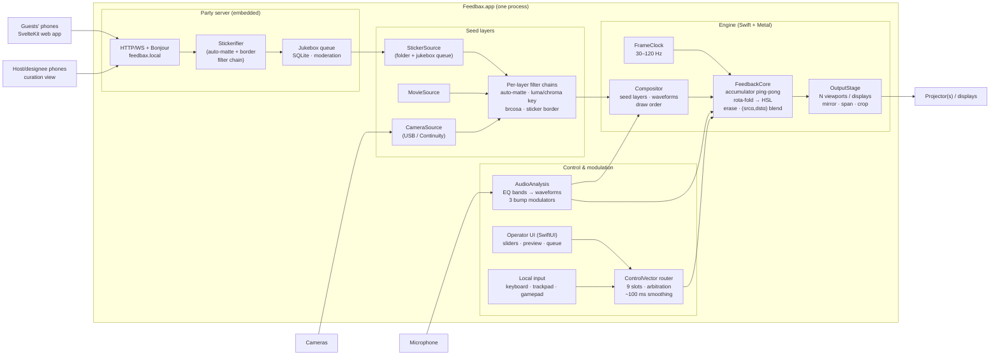
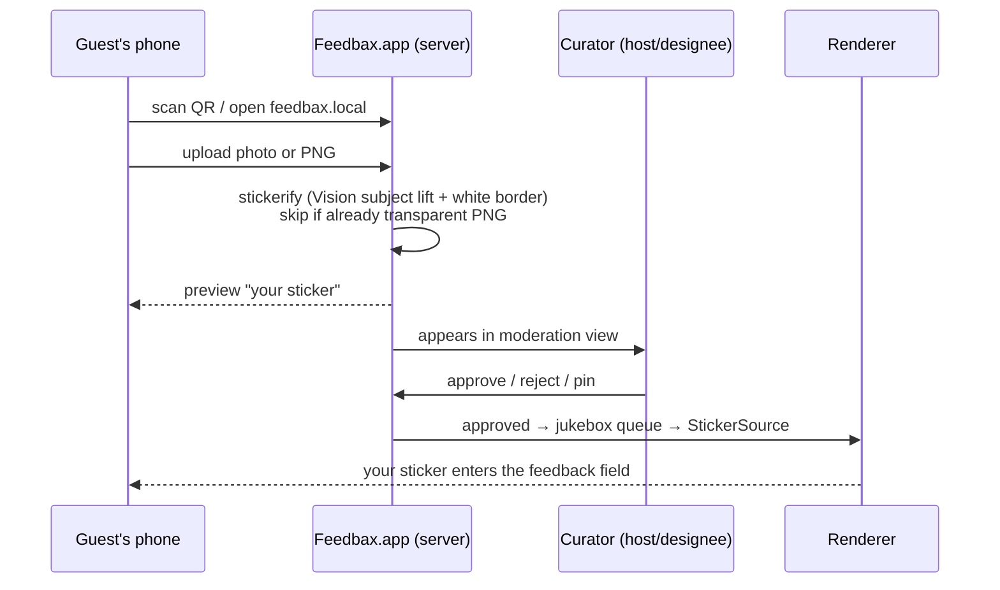

# Feedbax reimplementation — substrate proposal and design

**Status:** proposal for review · **Date:** 2026-08-23
**Source of truth for behavior:** [`docs/spec/`](../../spec/README.md) (the extracted description of what
Sean's patch does). This document decides *where* and *how* to rebuild it, not *what* it does —
where the two disagree, `docs/spec/` wins.

---

## 1. Goals

Ranked. The first two are the drivers named for this proposal; the rest come from the project's
history and the party scenario.

1. **Accessibility.** A non-technical person double-clicks an app and Feedbax runs. No Max
   license, no patch files, no engine preferences, no "why is the window black" (the failure mode
   that motivated the diagnosis doc).
2. **Extensibility.** Adding a new way to get imagery/video into the instrument, a new
   transformation of it on the way in, or a new way to control it means implementing one small
   interface, not rewiring a patch.
3. **The party scenario.** A mac mini + projector + microphone is a complete rig. Guests hit
   `feedbax.local` on their phones, upload images that get stickerified, and a curated jukebox
   queue feeds them into the visuals. People near the rig affect the rendering in ways they can
   understand. Cameras and depth/hand sensors are additive, not required.
4. **Fidelity.** Sean was proud of 8K. Mac-mini-class Apple silicon is the minimum bar; the port
   should exploit unified memory and Metal, and reproduce the documented look *exactly* — the
   fold math, the non-standard blend, the HSL drift (§6 checklist).
5. **Multi-display.** Something Sean never got out of Max. The architecture should treat outputs
   as N viewports over one canvas from day one, even if the first pass ships with one.

### Non-goals (first pass)

* Cross-platform. We buy the Mac APIs deliberately (see §3 trade-offs).
* A third-party plugin SDK. Extensibility means clean *internal* protocols; scripting/embedding
  can come later without redesign.
* NDI, PTZ camera control, Mira/iPad parity. The control-surface *shape* survives (§5); the
  specific hardware bindings don't.
* Preset/scene recall beyond load-time defaults — the original never had it (spec §04). A minimal
  "save current settings" is cheap and worth doing, but performance-grade preset morphing is not
  first-pass.

---

## 2. What we're porting, in one breath

A 60 Hz feedback loop: partially erase the accumulator, warp the previous frame
(rotate/zoom/pan with mirror-fold edges, additive HSL shift), draw fresh seed material *under* it
(stickers, movie frames, keyed camera, two audio waveforms), blend the warped past over the
present with `(SRC_ALPHA, DST_ALPHA)`, capture, repeat. Seven live control slots ramped over
~100 ms, plus an *unsmoothed* erase amount and a hard kaleidoscope sign-flip. That's the whole
instrument;
the character lives in about five exact constants and two shaders (spec README, "What makes the
look").

This is *small*. The Max patch is large because Max makes plumbing visible and Sean kept eight
years of scaffolding. The extraction pass confirms the portable core is ~3 fragment shaders, one
compositor, one audio analysis chain, and a control-vector router.

---

## 3. Substrate decision

### Options considered

**A. Native Swift + Metal app, with the guest-facing web app in SvelteKit (recommended).**
SwiftUI shell; Metal render core; AVFoundation for cameras (USB, and any iPhone via Continuity
Camera — zero drivers); AVAudioEngine + vDSP for mic analysis; Vision's subject-lifting
(`VNGenerateForegroundInstanceMaskRequest`, macOS 14+) for stickerification; an embedded HTTP/
WebSocket server (Hummingbird; FlyingFox is the fallback if Hummingbird's WebSocket support or
bundle weight disappoints at P2 planning) serving a static SvelteKit build; Bonjour for
`feedbax.local`; GRDB/SQLite for the queue; Developer ID + notarization for "download and
double-click". Minimum deployment target: **macOS 14 (Sonoma)** — required by subject lifting
and `CAMetalDisplayLink`.

* *For:* Every hard requirement lands on a first-class API. Camera frames reach the GPU zero-copy
  (`CVMetalTextureCache` — the unified-memory win, material at 4K camera input). Multi-display is
  native (`NSScreen` + one `CAMetalLayer` per output). Stickerification is a free, excellent
  on-device model. Permissions (mic/camera) behave like an app, because it is one.
* *Against:* Mac-only, and Swift isn't Ethan's daily language. Mitigation: everything guest- and
  curator-facing is SvelteKit (the daily stack); the Swift core is small and changes rarely once
  parity is reached — the extension points (§5) are deliberately the boring part.

**B. Rust + wgpu.** Portable, Metal underneath, excellent GPU abstraction.
* *Against:* the non-GPU half fights the platform — camera capture on macOS via third-party
  AVFoundation bindings, no Vision (stickerify needs a bundled ONNX model), windowing/fullscreen/
  multi-display rougher, signing/packaging DIY. We'd spend the portability dividend before ever
  leaving the Mac, and the "use the Mac APIs" driver says we don't want to leave.

**C. Web-first (Tauri/Electron + WebGPU).** Entirely in the daily stack.
* *Against:* 8K60 ping-pong is at the edge of what a webview will sustain on a mini; fullscreen
  across multiple displays from a browser context is genuinely bad; camera/format control and
  future depth sensors are constrained by browser APIs. The web layer is the right tool for the
  *phone-facing* surface — which every option includes — but the wrong place for the render loop.

**Rejected without deep analysis:** TouchDesigner (recreates the Max problem: license, runtime,
not an app), openFrameworks/Cinder (C++ maintenance for fewer platform wins than Swift),
Unity/Godot (an engine's worth of ceremony for three shaders, plus export/licensing friction).

### Recommendation

**Option A: native where the GPU and the devices are, web where the people are.** One process,
one .app: the Metal engine and the embedded server live together, so the queue, the renderer, and
the operator UI share state without IPC.

The Swift core is also a stated learning vehicle — the maintainer intends to pick up Swift
through this codebase — so the engine is written to teach: small modules, doc comments that
explain *why*, no cleverness. That is the same property that keeps the extension points
approachable. (This is a code-review convention, not a deliverable.)

---

## 4. Architecture



### The frame loop (unchanged from spec, restated for the port)

Per tick, in this exact order (spec README; ordering is load-bearing):

1. Partially erase the accumulator toward black: `α = 0.8 + 0.2·t³`, `t` = erase control ∈ [0,1].
   A blend toward the erase color, never a clear; **α is the one unsmoothed parameter**.
2. Warp the previous frame's texture: rota (inverse warp, pixel coordinates, anchor 0.5/0.5,
   mirror-fold bounds) → additive HSL. (v122 appended a brcosa output grade here; v1 omits it —
   see §6 decision 13.)
3. Draw seed layers and waveforms *first*.
4. Draw the warped previous frame *over* them as a full-screen quad with blend
   `(SRC_ALPHA, DST_ALPHA)` — not alpha-over.
5. Present; the accumulator becomes next frame's "previous" by ping-pong swap.

Where Max needed a fragile screen-capture step (the very thing that broke the repo on Max 9), a
Metal port renders to texture natively — step 5 is a pointer swap, not a copy. Same math, zero
legacy risk.

**Resolution/rate:** presets 720p → 8K (7680×4320) and 30–120 Hz, plus custom. Live re-size of
the accumulator; contents clear to the erase color on resize (the spec confirms live resize but
not what the original did with the old contents — clear is the defined, testable choice). RGBA8
accumulator by default (the original round-tripped every frame through the 8-bit window
framebuffer, though its `fst` texture is declared `@type long` — verify effective depth during
parity review); RGBA16F as a quality toggle where bandwidth allows.

**8K feasibility, honestly:** an 8K RGBA8 surface is ~127 MB. With the warp+HSL fused into one
pass and composite-in-place (no copy, ping-pong swap), a frame touches roughly 3 full surfaces
≈ 380 MB → ~23 GB/s at 60 Hz — comfortable even on a base M-series mini (M4 ≥ 120 GB/s).
RGBA16F at 8K60 (~46 GB/s) also fits. Sean hit 8K in Max over OpenGL 2; Metal on Apple silicon
clears that bar with headroom for the camera and multi-display work Max couldn't do.

**Multi-display:** the engine renders one canvas; each attached display gets a window +
`CAMetalLayer` viewport with modes *mirror*, *span* (canvas partitioned across displays), or
*crop* (each display frames a region). Per-display vsync via `CAMetalDisplayLink`. Multi-display
lands in P3, first as mirror + span, crop later; P1 ships one fullscreen display with the
viewport abstraction already in place — the abstraction is what matters now.

---

## 5. The extension interfaces (driver #2)

Four small protocols, extracted from how the original actually routes data. Everything the party
scenario adds later — depth sensors, more cameras, generative layers, new looks on the way in —
is an implementation of one of these, not a change to the engine.

All four receive a `FrameContext`: frame index, host time + delta, canvas resolution, the
frame's `MTLCommandBuffer`, and a texture-pool allocator. Texture lifetime is pooled and
per-frame: a filter renders into a pool-leased texture valid for the current frame only, and the
*chain* (not the filter) owns the leases — an 8K chain cycles two pooled surfaces instead of
allocating per filter. Chain intermediates are RGBA16F so unclamped stages (brcosa) carry
out-of-range values into the next filter, matching Jitter's float pipeline.

### `SeedSource` — "a thing that produces imagery"

```swift
protocol SeedSource: AnyObject {
  var id: SourceID { get }
  /// Called on the frame clock. Return the current texture, or nil to skip this frame.
  func tick(_ frame: FrameContext) -> MTLTexture?
  var transform: LayerTransform { get set }   // position, scale, rotationZ (imageMove shape)
  var layer: LayerSettings { get set }        // z-order, blend mode, enabled
  var capabilities: SourceCapabilities { get } // .keying, .deviceSelection, .list, .ptz…
}
```

Rules the extraction surfaced, honored at the protocol level:

* Sources decode on *selection*, never per render frame; movies advance on their own clock
  (AVPlayer), and `tick` merely fetches the current frame.
* Sources produce **raw** imagery. Everything done to it on the way in — keying, color, matting —
  lives in the layer's *filter chain* (next section), not inside the source. Writing a new look
  never means writing a new camera.
* List-backed sources (sticker folder, jukebox queue) publish their item count so index-based and
  normalized-[0,1] selectors rebind live on rescan.
* The original's camera-vs-picture either/or becomes the parity configuration of *one* layer —
  a single explicit mode switch, fixing the documented three-toggles-that-must-agree and
  last-writer-wins enable races. The compositor itself is N-layer (z-order and blend per layer),
  so the party and room phases run several seed layers at once; the original simply never had
  more than one. This — plus the filter chains — is the "mixer" the original lacked.

Built-in implementations, in build order: `StickerSource` (folder scan → later fed by the queue),
`MovieSource`, `CameraSource` (USB + Continuity), and later `NDISource`, `DepthSource`.
Waveforms are not textures — they stay a built-in compositor layer (polyline geometry), matching
the original's radial/linear line drawing with per-attribute bindings.

### `TextureFilter` — "a thing that transforms imagery on its way in"

```swift
protocol TextureFilter: AnyObject {
  var id: FilterID { get }
  var enabled: Bool { get set }
  /// Texture in, texture out, on the frame clock.
  func apply(_ input: MTLTexture, _ frame: FrameContext) -> MTLTexture
}
```

Every seed layer owns an ordered filter chain between its source and the compositor — the
channel strip the original never had (its keying was hardwired into the camera path). Any filter
attaches to any source. Built-ins:

* **`AutoMatteFilter`** — the headline addition relative to the original: automatic background
  removal on *any* source. Live video and movies use Vision person segmentation per frame — it
  runs on the Neural Engine, so it doesn't compete with the 8K loop for GPU bandwidth, and its
  masks arrive low-res and upsampled, which suits this instrument fine. Stills use subject
  lifting (any subject, higher quality), run once at decode and cached. Arbitrary-subject matting
  on *live* video is heavier; it ships as a reduced-cadence mode (refresh the mask every 10–30
  frames, tunable) to experiment with.
* **`LumaKeyFilter` / `ChromaKeyFilter`** — the parity keyers (two-pass midtone cascade;
  HSV-weighted chroma), their strict either/or preserved as a UI rule on the camera chain, not
  as a chain limitation.
* **`BrcosaFilter`** — the unclamped camera color stage (gated off by default, hot dial
  defaults 1.55/1.55/1.5, per spec §02 §7.2). The same filter *could* later be appended to the
  output chain to recover Sean's v122 output grade, but v1 ships without that (decision 13).
* **`MatteOverlayFilter`** — the vignette matte, reading alpha (the fixed version, §6). Default
  mask = full-alpha identity, so enabling it changes nothing until a shaped mask is chosen; lands
  in P3 with the camera chain.
* **`StickerBorderFilter`** — dilated white outline. `AutoMatte → StickerBorder` *is*
  "stickerify": the party upload path (§7) runs exactly this chain at ingest, so upload-time and
  live-time background removal are one implementation.

Parity defaults per layer: camera = brcosa → matte overlay → keyer (the original's order, spec
§02 §7.2–7.3); sticker and movie = empty chain (file alpha passes straight through, as the
original). Note no P1 parity default runs a filter live — the camera chain arrives with P3
(§10 spells out how P1 pins the filter implementations anyway).

### `ControlSurface` — "a thing a performer steers with"

Produces (partial) writes into the 9-slot control vector (hue, lightness bias, [dead], panX,
panY, zoom, theta, [dead], saturation) with the documented per-slot range mappings. The router
owns: recompute-every-frame + diff-before-broadcast, the hard-cut arbitration between surfaces
with a presence watchdog (Leap-style: tracked source primary, manual fallback after 2 s), global
smoothing (100 ms ramp / 4 ms grain, both global knobs), and SInvert.

```swift
protocol ControlSurface: AnyObject {
  var id: SurfaceID { get }
  /// Every frame: the slots and toggles this surface currently asserts,
  /// or nil to assert nothing (lets the arbitration watchdog fall through).
  func poll(_ frame: FrameContext) -> ControlWrite?
}
/// A partial write: only the slots this surface asserts, plus discrete toggle events.
struct ControlWrite {
  var slots: [ControlSlot: Float]
  var toggles: [ToggleEvent]   // SInvert, live/picture mode, bump enables, fullscreen…
}
```

Toggles are discrete events, not smoothed values — they bypass the ramp and apply in arrival
order (the original's hard cuts). The bindings table (surface input → slot or toggle, with its
range map) is a versioned JSON resource loaded at startup and hot-reloadable — remapping an
axis is data, not code.

**Deviation (Task 11):** `ControlSurface.poll` takes `TimeInterval`, not `FrameContext`.
Surfaces need only a clock to time their own gestures/ramps, not textures or a command
buffer, and `TimeInterval` keeps them constructible and testable without Metal. `ControlWrite`
also gained an `eraseStep: Float?` field beyond what's shown above — a relative nudge to
`ControlRouter.eraseControl`, applied immediately and clamped to 0...1 (erase stays outside
the 9-slot vector and never ramped, per §01 §2).

The performer's baseline is local hardware, present from P1 — the original gave the performer
~7 continuous axes plus booleans, and that must not wait for exotic surfaces:

* **Operator-UI sliders** — every axis and toggle, always available.
* **Keyboard + trackpad** — the trackpad is the pan surface (the original's shader-pan touch
  role), pinch/scroll drives zoom, modifier-held drags take hue/theta, and keys carry the
  booleans (SInvert, live/picture mode, bump enables, fullscreen).
* **Game controller** (GameController framework — stock PS/Xbox pads pair natively): two sticks
  and two triggers are six analog axes — sticks → pan + hue/lightness, triggers → zoom/theta,
  d-pad steps erase and saturation, buttons carry the booleans. A ~$40 gamepad covers nearly the
  whole control vector with zero custom hardware.

Later surfaces: touch (the two-role split the original used), hand tracking (the spec §04 Leap
mapping ports directly), MIDI/OSC — each is new rows in the bindings table.

### `Modulator` — "a signal that animates a parameter"

```swift
protocol Modulator: AnyObject {
  var id: ModulatorID { get }
  /// Called on the frame clock; the current level.
  func sample(_ frame: FrameContext) -> Float
}
```

A named scalar updated per frame, bindable (via the same bindings table) to any modulatable
parameter — rendering parameters (quad-Z bump, waveform alpha, erase…), layer transforms, and
control-vector slots. A slot or transform binding contributes an **additive offset** on top of
the arbitrated surface value, outside the router's ~100 ms ramp — a modulator carries its own
envelope dynamics (see the slides below), so nothing double-smooths, and offsets never
participate in the hard-cut between surfaces.

Built-ins are the three audio followers, matching spec §03/§04 exactly (*levels, not onset
detectors*; default off, as the original):

* **worldBump** — 144.3 Hz biquad → rectify (`abs`) → slide 2500/2500 (symmetric, despite the
  original UI offering asymmetry) → per-frame sample; drives the quad-Z bump.
* **waveBump** — reuses waveform 1's 46.7 Hz band ×2.2, per-frame mean, *no rectifier*; drives
  waveform alpha.
* **kittyBump** — same 46.7 Hz band, per-frame mean, then `abs` + slide 22/14 on the receiver
  side; adds onto the sticker layer's transform — scale and Y placement — on top of the manual
  controls. This is the original's audio-kick→sticker-bounce (spec §04 §1.3), easy to miss
  because the follower lives patch-side and the slew webUI-side.

(The 60 Hz band feeds waveform 2's display only — no follower runs on it.) Later: camera
presence/motion, depth proximity. The original had no LFOs and no idle drift — we keep that
discipline; a party rig that "does something on its own" is a different instrument.

### Presets (P1)

A preset is one JSON file: the 9-slot control vector, toggle states (SInvert, live/picture
mode, bump enables), per-layer source selection (sticker index / movie path), `LayerTransform`,
`LayerSettings`, and filter-chain parameters. Resolution/rate and display assignment are
deliberately excluded — venue properties, kept in app settings. Save-current / recall from the
operator UI; cold start still loads the original's defaults, untouched. §9's golden-frame
scenarios are a preset plus a scripted control timeline plus a fixed clock.

---

## 6. Fidelity checklist

The port is judged against `docs/spec/`. The items a naive port gets wrong, promoted here so they
end up in tests (§9):

| # | Invariant | Source |
|---|---|---|
| 1 | Fold bounds = period-2·size *reflection* (`mix(wrap, size−wrap, …)`), not wrap/clamp | spec §01 |
| 2 | Rota is an inverse warp in pixel coordinates; verify rotation handedness empirically | §01 |
| 3 | Feedback quad blend = `(SRC_ALPHA, DST_ALPHA)`; render clear stays standard | §01 |
| 4 | Erase `α = 0.8 + 0.2·t³`, clamped [0.8, 1.0], **never smoothed** | §01 |
| 5 | HSL shift is additive in HSL space; hue wraps, sat/light clip | §01 |
| 6 | All 7 live slots ramp ~100 ms (global), per-slot range maps per spec table | §01/§04 |
| 7 | SInvert negates zoom + offsets → point-mirror kaleidoscope; first-class toggle | §01 |
| 8 | Draw order: seeds/waveforms under, warped past blended over | §01 |
| 9 | Cold-start defaults: hue 0.02, lightness 0.5, sat 0.5 (nonzero, visually significant) | §01 |
| 10 | Bumps are smoothed levels, default off; wave-2 alpha = base + envelope, unclamped; kittybump adds onto sticker scale/Y placement | §03/§04 |
| 11 | Waveform 1: radial, bottom, thick burnt-orange; waveform 2: dotted cyan, `(srcα,dstα)` | §03 |
| 12 | Parity default keeps keyers on the camera chain only; luma = two-pass midtone cascade; chroma HSV weights (4,1,2) | §02 |
| 13 | Output brcosa: omitted in v1 (v123 parity — the stage is dead-wired in v123). `BrcosaFilter` ships anyway for the camera chain, so re-adding the v122 output grade later is appending that filter to the output chain. Low-risk: the v122 dials init to 1.0/1.0/1.0, an exact identity, so v122 topology at defaults renders pixel-identical to v123 | §01/§05 |
| 14 | No LFOs, no idle animation, no auto-drift | §04 |
| 15 | **Verified** — primary basis: static wiring analysis (spec §03 §3: the dead `gswitch` signal-patched into `*~ -0.5`'s cold inlet, silencing wave 2's input multiplier). Corroborated by live behavioral test (Task 25): muting `adc~` entirely and playing a loud transient (`Glass.aiff`) produced no waveform-2 change beyond measured jitter (cyan-pixel IoU 0.777 vs quiet-baseline 0.754, visually indistinguishable). Test had no independent positive control on session's audio path. Port keeps `wave2InputGain = 0.0`; reviving wave 2 is an operator tunable, not parity. Also settles §12 q.2: coarse `downsample=512` (→ 2 points) confirmed by same session | §03 |

Known original bugs we fix rather than port: the layer-enable last-writer race (becomes an OR),
the RGB-luminance vignette that made the circular matte a no-op (read alpha), the duplicated
uncoordinated chroma-key control sources (one source of truth), waveform-2's audio alpha
clobbering the user's RGB (compose alpha only). The enable race and the duplicated chroma
controls are flagged in the audits as accidental; the vignette and the wave-2 clobber are
flagged for verification rather than confirmed (spec §02 §6, §03 open q. 7) — we fix all four,
and the parity review re-checks the result against archived footage.

---

## 7. The party subsystem

### Guest flow



* **Reachability.** The app binds :80 (unprivileged on macOS) and advertises via Bonjour. Honest
  nuance: `feedbax.local` resolves when the mini's Local Hostname is set to `feedbax` — a
  one-time setting the app's setup screen offers to apply. iPhones resolve `.local` natively;
  Android browsers often don't, so **the projected QR code always carries the numeric-IP URL**
  and `feedbax.local` is the memorable alias, not the mechanism. If :80 is already taken the
  server falls back to :8080, and the QR carries whatever port is actually bound (the
  `feedbax.local` alias is only clean on :80). Networkless parties: the mini hosts its own Wi-Fi
  via Internet Sharing, or a pocket travel router; both documented in setup.
* **Stickerification.** The upload path runs the same `AutoMatte → StickerBorder` filter chain
  the renderer uses (§5): Vision subject lifting produces the cutout, a dilated white border
  gives the sticker look. Uploads that are already transparent PNGs pass through untouched.
  On-device, no cloud, fast on Apple silicon. Accepted uploads: JPEG/PNG/HEIC up to 20 MB;
  animated formats rejected in v1. The guest always sees the preview before the sticker enters
  the queue; when subject lifting finds no subject, the upload ships un-matted (full rectangle +
  border) — the preview makes that legible rather than surprising. Pipeline failures return a
  friendly retry, never a silent drop.
* **Curation.** Guests are anonymous per-device IDs with a per-guest rate limit (default 5
  uploads per 10 minutes, curator-adjustable). The host and
  PIN-invited designees get the moderation view (approve/reject/pin/eject, auto-approve toggle —
  default *hold until approved*). The operator UI mirrors the same queue.
* **Jukebox.** Approved stickers rotate through `StickerSource` on a fair queue (round-robin per
  guest, pins jump the line), each entering with the imageMove-style placement transform so the
  performer — or a presence modulator — can steer where new material lands.
* **State.** SQLite via GRDB; media under Application Support per party session. A party is a
  named session you can reopen ("last Saturday's stickers").
* **API contract.** The HTTP/WS surface (upload, moderation actions, queue events), the
  designee-PIN mechanism, and the anonymous device-ID scheme are pinned as the first P2
  planning task; `web/` and `Party/` both build against that contract, and §8's mock API
  implements it.

### Guests affecting the rendering, comprehensibly

P3 (Room) needs no new hardware: the keyed camera already puts *your silhouette* into the feedback
field (spec §02 — the most comprehensible mapping there is), and a motion-centroid modulator can
stir pan/hue so movement visibly perturbs the attractor. Depth sensors and hand tracking slot in
later as `Modulator`/`ControlSurface` implementations — the spec's Leap mapping is the template —
with hardware options (OAK-D-class depth, Ultraleap) evaluated when we get there, behind
interfaces that don't care.

---

## 8. Repo and code layout

```
feedbax/
  app/            Xcode project — Feedbax.app
    Engine/       FeedbackCore, shaders (.metal), Compositor, OutputStage
    Sources/      SeedSource protocol + StickerSource, MovieSource, CameraSource
    Control/      ControlVector router, surfaces, modulators, AudioAnalysis
    Party/        embedded server, stickerifier, queue, sessions
    UI/           SwiftUI operator interface
  web/            SvelteKit (static adapter) — guest upload + curation views
  docs/spec/      unchanged — the behavioral source of truth
  patches/        unchanged — the Max original, kept as reference artifact
```

The web build is embedded in the app bundle as static assets; `web/` develops standalone against
a mock API, in the daily SvelteKit toolchain.

---

## 9. Testing

* **Shader math as pure functions.** Fold, rota, HSL-add, brcosa, both keyers implemented once in
  Metal and mirrored in a tiny CPU reference; unit tests pin them to hand-computed values,
  including fold reflection at the ±edges and hue wrap. This is where checklist §6 lives.
* **Golden-frame tests.** Deterministic scenario scripts — a preset file (§5) + a scripted
  control timeline + a fixed clock — rendered and compared across commits with a per-pixel
  tolerance (max channel delta ≤ 2/255 on ≥ 99.9 % of pixels) against references regenerated
  per pinned OS/hardware baseline; exact hashes are too fragile across GPU/OS updates. Catches
  "the look drifted" without eyeballs. Scenarios exist that attach the keyers/brcosa to a movie
  layer, so the P1 filter implementations stay pinned before the camera exists (§10).
* **Parity review.** Side-by-side v123 patch vs. port on the same inputs — human-judged, since
  Max-vs-Metal bit-equality isn't achievable or needed. Sean's archived stills are references.
* **Party subsystem.** Vitest for the SvelteKit app; Swift tests for queue/moderation state
  machine; one scripted end-to-end (upload → stickerify → approve → appears in a frame hash).

---

## 10. Phasing

| Phase | Deliverable | Proves |
|---|---|---|
| **P1 — Parity instrument** | Feedbax.app: engine + per-layer filter chains (brcosa, keyers) + sticker folder + movie playback + mic waveforms/bumps + operator UI + keyboard/trackpad and gamepad surfaces + fullscreen + res/rate presets + still capture + minimal presets (save/recall current settings) | The look survives the port (checklist §6, golden frames); performable with stock hardware; sustains 8K/60 for ≥ 10 min at parity defaults on a base M4 mini (p99 frame time < 16.7 ms, measured by a built-in frame-time HUD) |
| **P2 — Party** | Embedded server, upload → stickerify → moderation → jukebox, QR overlay, sessions; `AutoMatteFilter` lands here (stills + movies) | The mini-at-a-party story end to end |
| **P3 — Room** | CameraSource + the live camera chain (brcosa · matte overlay · keyers) + keying UI, live auto-matte, presence/motion modulators, multi-display (mirror + span) | Guests affect rendering (checklist 12 end-to-end); Sean's unfinished multi-monitor wish |
| **P4 — Reach** | Depth/hand tracking surfaces, MIDI/OSC, NDI/Syphon interop | Each lands as a `SeedSource`/`ControlSurface`/`Modulator` implementation with `app/Engine/` untouched |

P1 is deliberately the whole *instrument*, not a tech demo — it replaces the Max patch for the
solo performer in picture/movie mode before anything party-shaped exists (the camera half of the
original's either/or arrives in P3, matching how rarely camera was used in recent performance).
The brcosa/keyer filter *implementations* land in P1, pinned by §9 unit tests and by
golden-frame scenarios that attach them to a movie layer; no P1 parity default runs them live,
and checklist 12's end-to-end camera parity is P3's to prove. Still capture = key-bound PNG
snapshot of the accumulator at canvas resolution into `~/Pictures/Feedbax/`.

---

## 11. Open questions

None currently.

### Resolved

* **Swift core** (2026-08-23): approved — and doubles as a Swift learning vehicle for the
  maintainer, which §3 folds into how the engine code is written.
* **Filter/mixer layer** (2026-08-23): the reviewer's instinct that a filter/mixer was missing
  was right — added as the per-layer `TextureFilter` chains plus the N-layer compositor (§5),
  with auto-stickerification (`AutoMatteFilter`) as the flagship filter.
* **Baseline local input** (2026-08-23): keyboard/trackpad and game-controller surfaces are P1
  deliverables covering the ~7 axes + booleans; exotic surfaces are additive.
* **Mac-only lock-in** (2026-08-24): committed. No deployment scenario vetoes Swift+Metal; the
  party layer stays portable by nature (any phone browser reaches the embedded server).
* **Name** (2026-08-24): stays **Feedbax** — continuity with Sean's instrument. The app is
  Feedbax.app; the party host is `feedbax.local`.
* **Minimal presets** (2026-08-24): yes, in P1 — snapshot the control vector + layer/filter
  params to a file, recall on demand. Doubles as reproducible state for golden-frame tests.
  Cold-start defaults remain the untouched load state, as the original.
* **Output brcosa** (2026-08-24): omitted in v1 rather than shipped as a toggle. Verified in the
  patch JSON that the v122 output-side dials initialize to 1.0/1.0/1.0 — an exact identity
  through the brcosa math — so the v122/v123 looks only diverge once a performer moves a dial.
  `BrcosaFilter` exists regardless (camera chain), so the v122 output grade is recoverable later
  by appending it to the output chain. Decision 13 updated to match.
